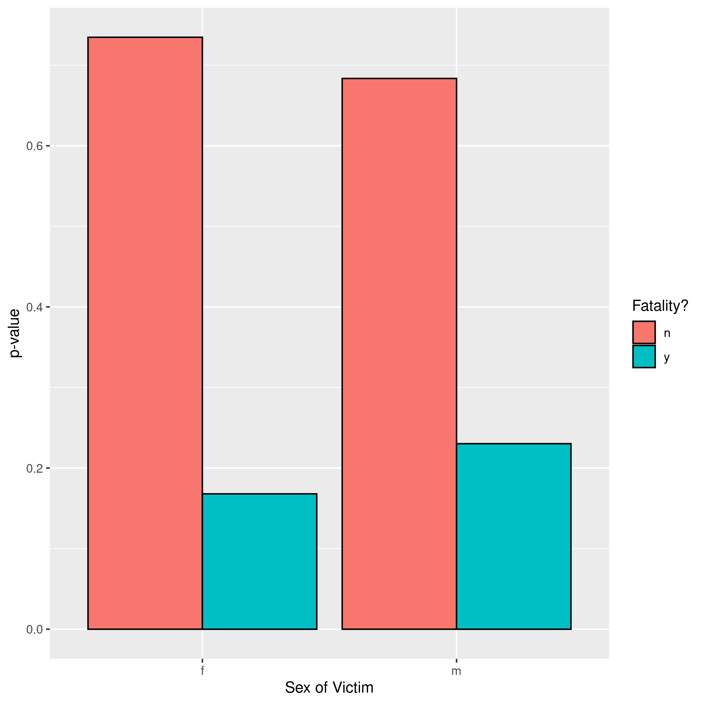
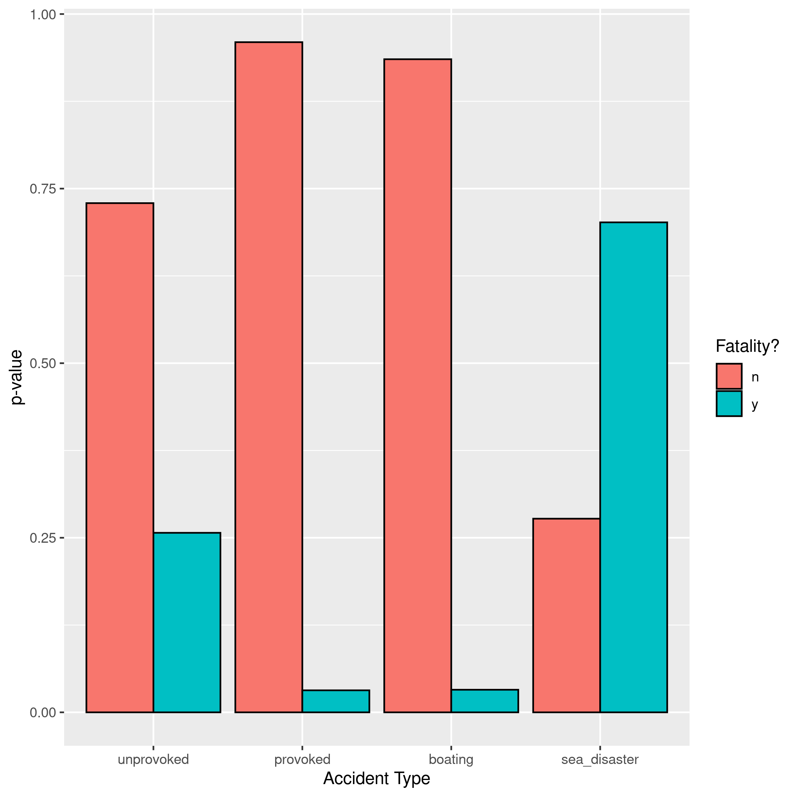

```{r}
source("utils.R")
ensure_directory("reports")
```

# Worldwide Shark Attacks

### Emma Wilson's shark attack database report for BIOS 611. 

#### December 8, 2021

#
Data was found here:
https://www.kaggle.com/felipeesc/shark-attack-dataset

This data collects all known shark attacks across the world, including provoked attacks, boating incidents, shipwrecks, and human remains found inside of sharks, along with as much information that was known about the date, location, victim, and incident itself. Because the data goes back over 200 years, much of the information is missing or not really standardized between entries, but there is still a lot of interesting data here to analyze!

The entries are identified by their Case Number, which is a unique identifier of the date of the attack, with multiple attacks on the same day being referred to as "2018.06.03.a", "2018.06.03.b" and so on. In cases where human remains were discovered either in the ocean or inside of a dead shark, the date of recovery was listed. 

## Data Cleaning and Filtering

To start, the data was cleaned to allow for data analysis of the attacks. Some of the columns of information such as the shark's species, type of injury reported, and what activity the victim was partaking in during the attack were so variable and incomplete in their reporting that they were not possible to succinctly clean or analyze (for instance, the species column had over 1,000 unique entries even after simplifying the strings as some sharks were reported by species, some by size, some by color, some by a combination, and others were reported as a possibility of multiple species. I would have loved to analyze the frequency of attacks and fatalities by different species, but did not have time to do so).

Other columns had only simple typos and were easy to clean (the attack type included boating, sometimes misspelled "boatong" or just "boat"). Interestingly, two of the attack types reported were whether the attack was provoked or unprovoked, which leaves one to wonder how that information was determined and how forthcoming somebody who provoked a shark attack might be in their reporting.

In addition to cleaning the data, I filtered out rows with invalid basic information about the attack, specifically the date of attack, the sex of the victim, and whether the attack was fatal or not; I kept NA/unknowns but did not include them in relevant analyses. Very few data rows had to be dropped because the quality of the database was fairly high, which is a nice surprise considering the oldest reported shark attacks were in the 1800s! 

## General Comments

Around 200 of the reported shark attacks seem to have been some form of disaster, such as a shipwreck or even an airplane crash. One entry reports nearly 200 deaths in a plane crash in 1996 where shark bites were found on some number of the bodies. Currently in the database this is being treated as only one attack/victim, and as a result the majority of the sea disasters are reported as fatalities, though it isn't clear if the sharks were responsible for the deaths or simply opportunistic feeders. 

Looking at location of shark attacks, the USA has the most reported attacks (2,228), followed up by Australia (1,337), South Africa (579), Papua New Guinea (133), New Zealand (128), and Brazil (112). Simply based on population, it is not surprising that the USA has the majority of the reported attacks (over 1/3). The USA has over 10x the population of Australia, while Australia has more than 50% of the number of shark attacks seen in the USA. South Africa has roughly double the population of Australia while reporting less than 50% of the number of attacks seen in Australia. While these population numbers don't account for tourists and the reporting doesn't specify if the victim was a tourist or a local, my takeaway is to be very careful in the Australian waters! 

Focusing further into the USA states, Florida reported the vast majority of the shark attacks (1,038), followed by Hawaii (298), California (289), South Carolina (160), North Carolina (104), and Texas (73). I was a bit surprised how close the Carolinas were to California's number. Perhaps more interesting, though, are the two shark attacks in Kentucky and Missouri. In Kentucky, 12 people were bit by small catsharks in an aquarium, which was reported as "provoked" when they stuck their hands into the water and the injuries were reported as "minor injuries, similar to paper cuts". Similarly, in an aquarium in Missouri, a woman was "swimming in fish tank" when she was bitten 5 times on her hand, another provoked incident. 

Some other highlights include a man who "dived naked into the water on a bet" off the coast of Australia and was bitten in the testicles, a woman who was bitten in the hand while "attempting to attract dolphins", a shark who leapt into a fishing boat and slammed its tail into a man's chest, and a group of men whose boat capsized in rough water and they survived on a makeshift raft with a few shark bites and were later rescued. While many of the repoted incidents were obviously serious tragedies, many of the reports are more lighthearted and silly with minimal/no injury. 

Common themes include attacks on surfers, spearfishers, swimmers, snorklers, scuba divers, canoers, and researchers grabbing sharks.

Some important considerations: Each "attack" entry should really be considered as one "incident," there are multiple entries with upwards of hundreds of victims that are being counted as one attack (especially sea disasters). Incidents with multiple people are considered "fatal" if only one person dies. Many "attacks" also probably wouldn't be considered "attacks" in the common sense; a person stepping on a dead shark and cutting their foot, a person petting a shark in an aquarium tank and hurting their hand, and other silly things are classified as "attacks." These seem to largely be considered "provoked attacks" and are part of the reason that the provoked attack fatality rate is so low, as opposed to the "unprovoked attacks" which tend to be what we would traditionally consider actual shark attacks. Many of these incidents greatly skew any data analysis; I personally would be more interested in only analyzing actual shark attacks, but it would take a ton of manually classifying the sillier versus serious incidents. 

## Shark Attack Fatality Rate by Sex

The vast majority of attack types reported were unprovoked and the majority of victims were male, so I wanted to quickly look at the type and sex categories and see how they related to fatality rates in the attacks. 

Looking at how sex correlates to fatality rate after normalizing sex counts, we see that men are slightly more likely to die to a shark attack (Figure 1).



## Shark Attack Fatality Rate by Type of Accident

Looking at how accident type correlates to fatality rate after normalizing type counts, we see that 70% of sea disasters were fatal, 26% of unprovoked attacks were fatal, and only 3% of provoked attacks and boating attacks were fatal. Very interesting that unprovoked attacks were more fatal than provoked attacks - perhaps that represents the hungry shark versus the shark who happened to be in the wrong place at the wrong time (Figure 2).



.